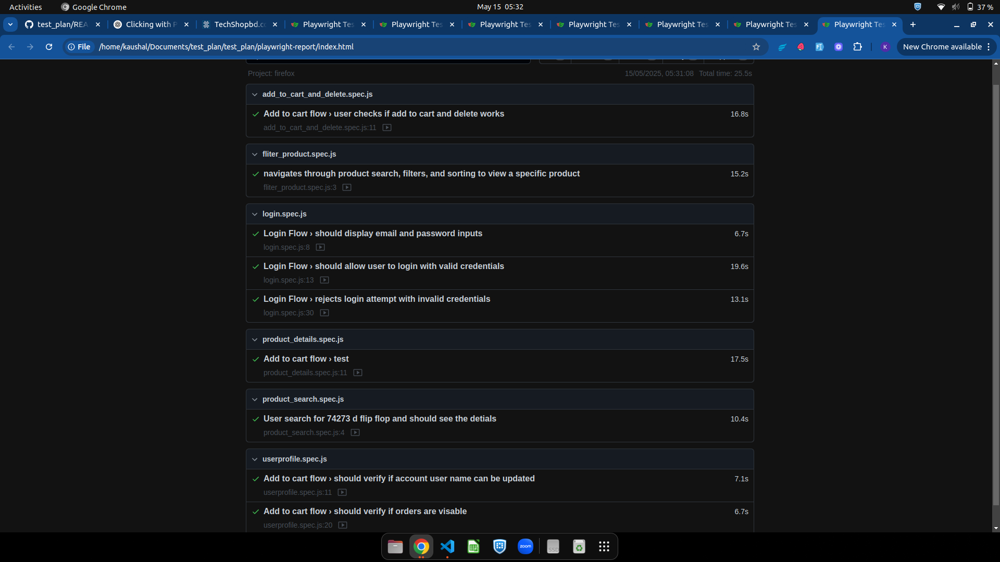

# 🧪 Test Plan for E-Commerce Website: [TechShopBD](https://techshopbd.com)

**Objective**: Ensure quality assurance and a flawless user experience.

## Test Charters

### 1. [Registration and Login](./test-charters/login_and_registration.md)
- Covers user account creation, login validation, password management, session handling.

### 2. [Product Search and Filtering](./test-charters/product-search-filtering.md)
- Ensures discoverability of products via search terms, filters, and suggestions.

### 3. [Product Detail Page](./test-charters/product-detail-page.md)
- Validates product information accuracy, imagery, and variants.

### 4. [Cart Operations](./test-charters/cart-operations.md)
- Tests functionality of adding, removing, and updating cart items.

### 5. [User Profile](./test-charters/user-profile.md)
- Verifies profile updates, order history, and access controls.

### 6. [Compatibility and Performance](./test-charters/compatibility-performance.md)
- Measures site responsiveness, browser support, and load handling.

--
## 🔍 View Automation Test Cases

You can view all automation test cases under the [`tests/`](./tests) directory.

| Test Module           | Description                                 |
|-----------------------|---------------------------------------------|
| `login.spec.js`       | Covers user login and registration flows    |
| `filter_product.spec.js` | Validates product filtering and search    |
| `product_detail.spec.js` | Verifies product detail page behavior     |
| `product_SEARCH.spec.js` | Verifies search product detail page behavior     |
| `add_to_cart_and_delete.spec.js` | Tests cart add/remove operations |
| `userprofile.spec.js` | Handles user profile-related scenarios      |

> All test cases are written using [Playwright](https://playwright.dev/) in JavaScript.
--
