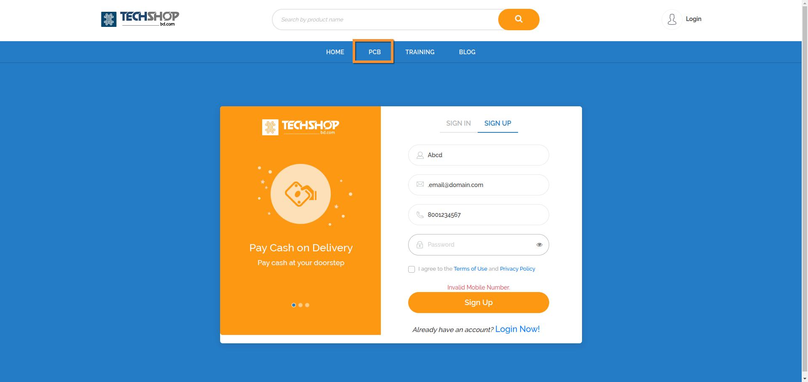
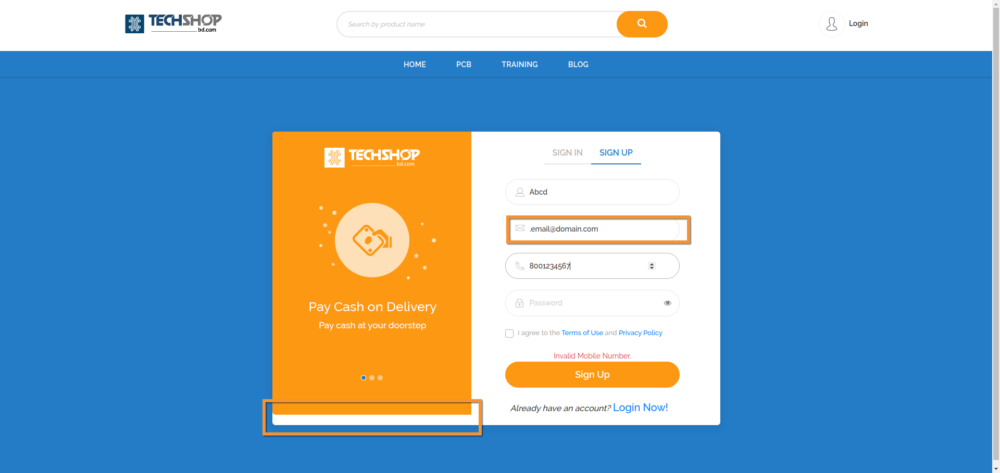
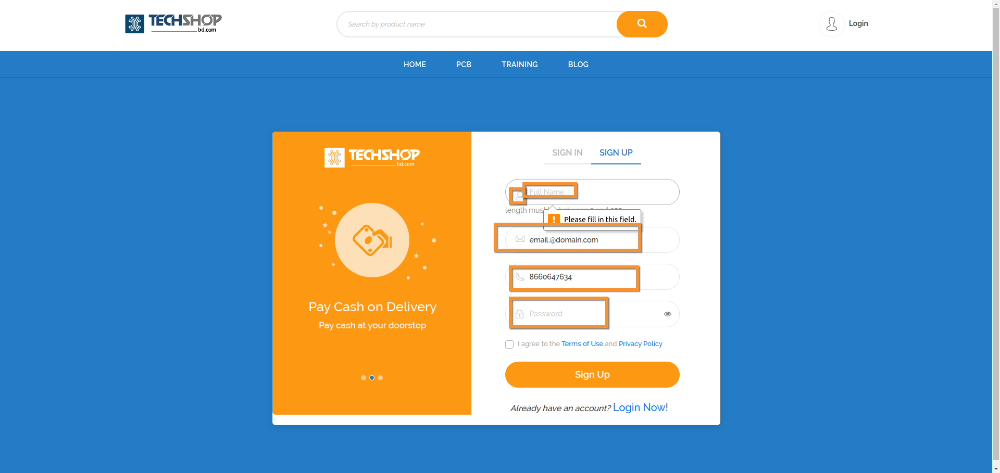
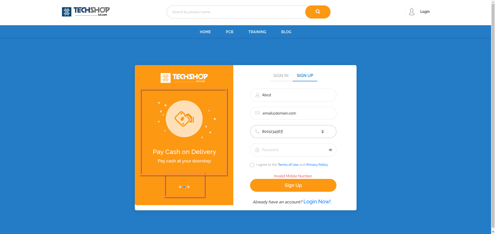

# 🧪 Test Charter: User Registration and Login System

---

## 🧭 CHARTER  
Validate the core registration and login functionality, ensure field-level validations, error handling, and UI feedback are functioning correctly. Assess security elements including session persistence and password reset. Confirm users can successfully register, log in, and manage account access securely and intuitively.

---

## 📋 AREAS

| Category        | Description                                                                 |
|----------------|-----------------------------------------------------------------------------|
| Functional      | Registration, Login, Password Reset, Session Management                    |
| UI/UX           | Form Field Behavior, Input Validation Feedback, Button States              |
| Navigation      | Redirects (e.g., PCB Page), Tab/Refresh Persistence                         |
| Security        | Inactivity Logout, Password Encryption, Email Verification                  |
| Error Handling  | Field-Level Errors, Invalid Credentials, Messaging Accuracy                |

---

## 🧑 TESTER  
Kaushal

---

## 🧱 TASK BREAKDOWN  

- Validate registration with various email/password combinations  
- Attempt duplicate registration  
- Test invalid input formats  
- Test password reset flow  
- Test auto logout on inactivity  
- Confirm session persists on refresh/tab change  
- Explore UI field behaviors  
- Inspect error message presentation  

---

## ⏳ DURATION  
**Long (1 hour)**

---

## 🕵️‍♂️ BUG INVESTIGATION & REPORTING  
Allocated Time: 20 minutes

---

## ⚖️ CHARTER VS. OPPORTUNITY  
**Structured: 85%**  
**Exploratory: 15%**

---

## 📝 TEST NOTES  

- Feature Validation: Registration, Login, Forgot Password  
- Security: Auto-logout, Session Persistence, Password Reset Link  
- Navigation: Redirect on auth-required pages, refresh/tab behavior  
- Error Handling: Input validation, incorrect credential response  
- UI/UX: Field focus behavior, placeholder/icon issues, slide behavior  

---

## ✅ TEST CASES  

| Test Case ID | Steps | Expected Outcome | Actual Outcome | Status |
|--------------|-------|------------------|----------------|--------|
| TC001 | Register with valid email and strong password | Account is created | Registration fails midway, account exists without password | Fail 🔗 [Bug #1](https://jam.dev/c/b53de7fa-49d3-4fc6-b900-6a9d28609dd8) |
| TC002 | Attempt duplicate registration | System prevents duplicate | Correctly blocked | Pass |
| TC003 | Login with valid credentials | Logged in successfully | Success | Pass |
| TC004 | Login with invalid password | Error displayed near password field | Generic message shown at bottom | Fail 🔗 [Bug #6](https://www.loom.com/share/8c16fae66fe64bc485a9ffb2a487d135) |
| TC005 | Navigate to protected page (PCB) without login | Redirected to login, clearly shown | Redirected but login page not highlighted | Fail 🔗  |
| TC006 | Validate email field with invalid formats | All invalid formats rejected | Some invalid formats accepted | Fail 🔗  |
| TC007 | Reset password with valid flow | Email sent, link works, password reset | Verification failed error | Fail 🔗 [Bug #10](https://jam.dev/c/0fc69442-2445-42a0-b867-677e5d3e71cf) |
| TC008 | Leave required field empty | Show field-level error | Icons and placeholders break | Fail 🔗  |
| TC009 | Test auto logout on inactivity | User is logged out | To be confirmed | Fail |
| TC010 | Refresh page mid-session | Session persists | Works correctly | Pass |
| TC011 | Check sign button state before and after valid input | Initially disabled, enabled after valid input | Sign button enables prematurely | Fail 🔗 [Bug #7](https://www.loom.com/share/fff113d54fbe4cd9b7dc97ec05c9de55) |
| TC012 | Input Bangladeshi phone as `017...` | Should suggest `+880...` | Fails without format hint | Fail 🔗 [Bug #8](https://www.loom.com/share/ab3d3a9b22c04d97adcb5dd76ebfacbb) |
| TC013 | Test login slideshow | Should rotate images | Only one image shown | Fail 🔗  |
| TC014 | Reset password UI field behavior | Button aligned, error message accurate | Button misaligned, wrong message | Fail 🔗 [Bug #9](https://jam.dev/c/09a90076-27d6-4a71-be26-31f72dda8403) |

---

## ⚠️ POTENTIAL RISKS  

- Stale user sessions not clearing  
- Registration ghost records (midway failures)  
- Misleading or unhelpful validation messages  
- UI misbehavior under error states  
- Internationalization issues with phone/email formats  

---

## 🐞 BUGS  

| Bug ID | Severity | Description | Steps to Reproduce | Status |
|--------|----------|-------------|---------------------|--------|
| #1 | High | Mid-registration failure creates unusable ghost account | Begin registration, disconnect midway, retry | Open 🔗 [Link](https://jam.dev/c/b53de7fa-49d3-4fc6-b900-6a9d28609dd8) |
| #2 | Medium | Login page not visually clear after redirect | Go to `/pcb` while logged out | Open  |
| #3 | Low | Slideshow does not rotate | Open login page | Open  |
| #4 | High | Email field accepts invalid formats | Input `.email@domain.com` etc. | Open  |
| #5 | Medium | Placeholder & icon layout break on errors | Trigger invalid input | Open  |
| #6 | High | Poor error handling in login | Enter wrong password after valid email | Open 🔗 [Link](https://www.loom.com/share/8c16fae66fe64bc485a9ffb2a487d135) |
| #7 | Medium | Sign button enables prematurely | Fill one field correctly | Open 🔗 [Link](https://www.loom.com/share/fff113d54fbe4cd9b7dc97ec05c9de55) |
| #8 | High | Phone field does not guide format | Enter `017...` number | Open 🔗 [Link](https://www.loom.com/share/ab3d3a9b22c04d97adcb5dd76ebfacbb) |
| #9 | Medium | Reset screen button misaligned, error wrong | Try forgot password | Open 🔗 [Link](https://jam.dev/c/09a90076-27d6-4a71-be26-31f72dda8403) |
| #10 | High | Reset password verification fails | Use reset flow | Open 🔗 [Link](https://jam.dev/c/0fc69442-2445-42a0-b867-677e5d3e71cf) |

---

## ❓ ISSUES & CLARIFICATIONS  

- What is the session timeout duration?  
- Should duplicate registration attempt trigger email verification instead?  
- Should user get a success message upon reset request?  

---

## ✨ ENHANCEMENTS  

- Add email format suggestions and live validation  
- Improve slide show carousel mechanics  
- Implement field-level validation tooltips  
- Highlight invalid fields with red borders  
- Add auto-formatting and country picker for phone input  
- Clear stale error messages on input change  
